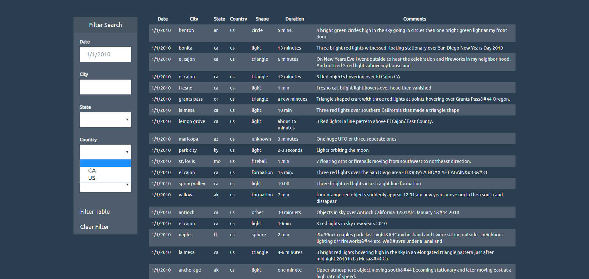

# ufo-sightings
UFO Sightings - JavaScript and DOM Manipulation

**Description**  
HTML page and associated JavaScript files that will create a table dynamically based upon the data.js dataset. The table can also be filtered by date, city, state, country, and shape.  

**Contents**
* screenshots/  
  * clear_filter.png
  * filter_1.png  
  * filter_2.png  
  * filter_3.png 
  * filter_4.png  
  * filter_5.png  
  * filter_6.png  
  * main_page.png
* static/  
  * css/  
    * style.css  
  * images/  
    * nasa.jpg  
    * ufo.svg  
  * js/  
    * app.js  
    * data.js
* index.html  